## 1. Table of Contents

- [1. Table of Contents](#1-table-of-contents)
- [2. 5 Types of Primitive Types](#2-5-types-of-primitive-types)
  - [2.0.1. Technically there are 2 more: Symbol & BigInt](#201-technically-there-are-2-more-symbol--bigint)
- [3. Numbers](#3-numbers)
- [4. Variables](#4-variables)
  - [4.1. Let](#41-let)
  - [4.2. Const](#42-const)
  - [4.3. Var](#43-var)
    - [4.3.1. Use Cases](#431-use-cases)
  - [4.4. Boolean](#44-boolean)
  - [4.5. String](#45-string)
  - [4.6. String Properties](#46-string-properties)
  - [4.7. Some String Methods](#47-some-string-methods)
    - [4.7.1. Using substring()](#471-using-substring)
    - [4.7.2. Using substring() with length property](#472-using-substring-with-length-property)
    - [4.7.3. The difference between substring() and substr()](#473-the-difference-between-substring-and-substr)
    - [4.7.4. Differences between substring() and slice()](#474-differences-between-substring-and-slice)
- [5. Template Literals](#5-template-literals)
  - [5.1. Math Object](#51-math-object)
  - [5.2. TypeOf Operator](#52-typeof-operator)
  - [5.3. parseInt & parseFloat](#53-parseint--parsefloat)
  - [5.4. Type Conversion](#54-type-conversion)
  - [5.5. Equality](#55-equality)
    - [5.5.1. Double Equals](#551-double-equals)
    - [5.5.2. Triple Equals](#552-triple-equals)
    - [5.5.3. Comparison](#553-comparison)
    - [5.5.4. Running Code in a Script](#554-running-code-in-a-script)
  - [5.6. Truthy & Falsy ness](#56-truthy--falsy-ness)
  - [5.7. Operator Precedence](#57-operator-precedence)
  - [5.8. Switch](#58-switch)
  - [5.9. When to Use and When Not-To Use Break](#59-when-to-use-and-when-not-to-use-break)

## 2. 5 Types of Primitive Types

1. Number
2. String
3. Boolean
4. Null
5. Undefined

#### 2.0.1. Technically there are 2 more: Symbol & BigInt

## 3. Numbers

1. JS has only 1 numbers, (as opposed to java,and C++ where we have int,float, double etc.), which can be whole numbers, integers ( + / - ), and decimal numbers
2. Does not store infinitely precise numbers (eg. 1.00090909090903 will give output **1**)
3. 5 \*\* 2 = 5 to the power 2 = 25
4. Arithmetic Operations follow BODMAS rule
5. NaN = Not a number
   1. 0 / 0 = NaN
   2. 1 + NaN = NaN
   3. 1/0 = Infinity (there's no way to store Infinity)
   4. -0 = -0 (This has its own value in JavaScript, Super Weird!)

## 4. Variables

### 4.1. Let

1. Reserved Keyword

### 4.2. Const

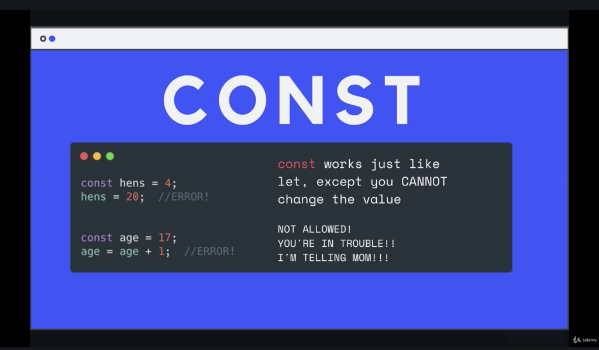

### 4.3. Var

1. It makes no sense to use it now-a-days. (Its the old way of using it)

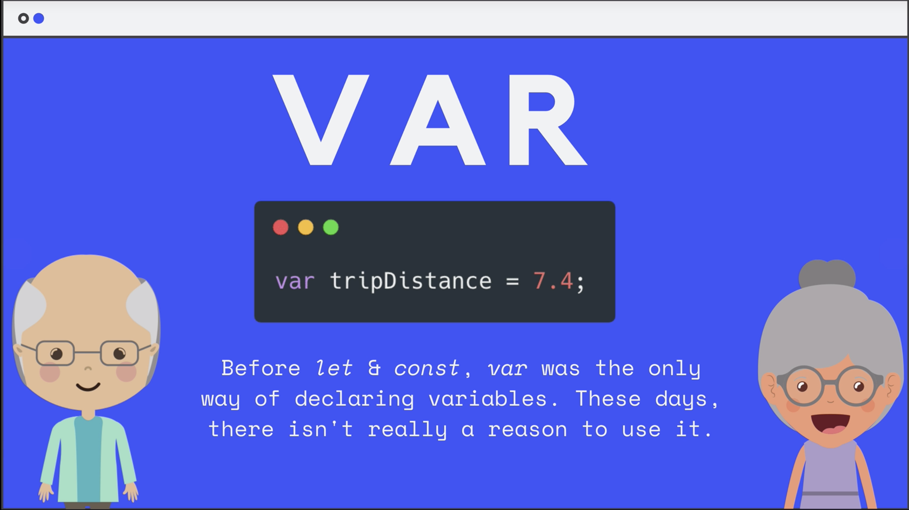

#### 4.3.1. Use Cases

```javascript
//var, let, const
//AR - Block Scoped
var name = 'John Doe';
console.log(name);
name = 'Steve Smith';
console.log(name);

// Init var
var greeting;
console.log(greeting);
greeting = 'Hello';
console.log(greeting);

// letters, numbers, _, $
// Can not start with number

// Multi word vars
var firstName = 'John'; // Camel case
var first_name = 'Sara'; // Underscore
var FirstName = 'Tom'; // Pascal case
var firstname;

// LET - Function Scoped
let name;
name = 'John Doe';
console.log(name);
name = 'Steve Smith';
console.log(name);

// CONST - Cannot be reassigned
const name = 'John';
console.log(name);
//Can not reassign
name = 'Sara';
//Have to assign a value
const greeting;
```

### 4.4. Boolean

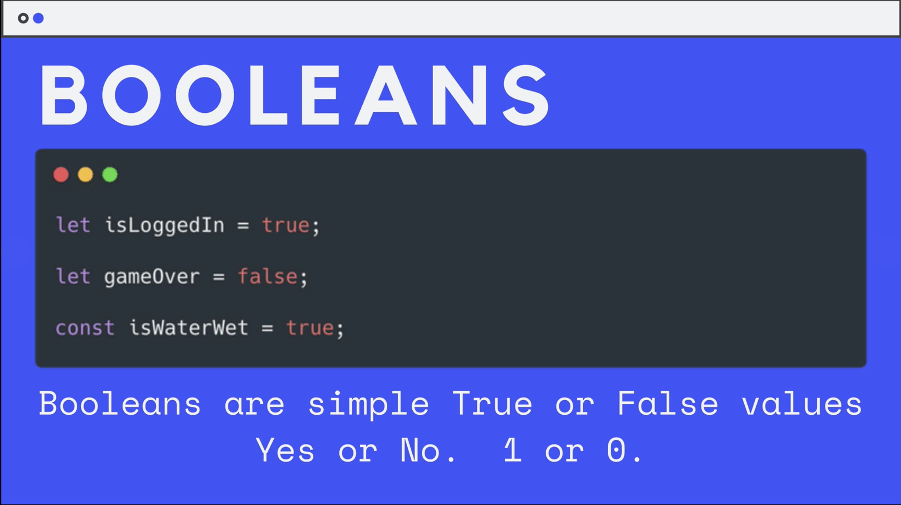

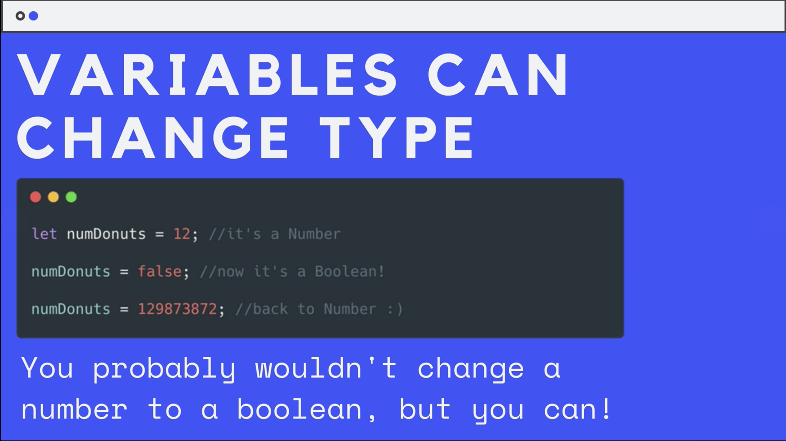

### 4.5. String

1. Be consistent with quotes!
   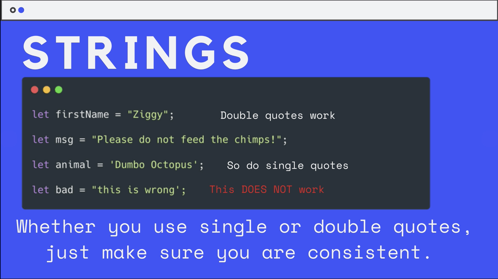

### 4.6. String Properties

1. `.length` property is used to access length of a string.
2. Strings are immutable. (A string characters cannot be changed/manipulated)
3. Every method on string does not change the string itself

   ```javascript
   let str = "Hello";
   str.toUpperCase(); // This will return "HELLO" but value of str will still remain "Hello"
   ```

### 4.7. Some String Methods

```js
// STRING METHODS AND CONCATENATION

const firstName = "William";
const lastName = "Johnson";
const age = 36;
const str = "Hello there my name is Brad";
const tags = "web design,web development,programming";

let val;

val = firstName + lastName; // O/P: "WilliamJohnson"

// Concatenation
val = firstName + " " + lastName; // O/P: "William Johnson"

// Append
val = "Brad ";
val += "Traversy"; // O/P: "Brad Traversy"

val = "Hello, my name is " + firstName + " and I am " + age;

// Escaping Characters
val = "That's awesome, I can't wait"; // O/P: "That's awesome, I can't wait" Notice that even though there are single quotes inside the double quotes, js treats them as characters
//Conversely this can also be written as val='That"s Awesome, I can"t wait' and this time double-quotes will be treated as characters

// Length
val = firstName.length; // O/P: 7

// concat()
val = firstName.concat(" ", lastName); // O/P: "William Johnson"

// Change case
val = firstName.toUpperCase(); // O/P: "WILLIAM"
val = firstName.toLowerCase(); // O/P: "william"

val = firstName[2]; // O/P: "l"

// indexOf()
val = firstName.indexOf("l"); // O/P: 2
val = firstName.lastIndexOf("l"); // O/P: 3

// charAt()
val = firstName.charAt("2"); // O/P: "l"
```

#### 4.7.1. Using substring()

The following example uses substring() to display characters from the string 'Mozilla':

```js
let anyString = "Mozilla";

// Displays 'M'
console.log(anyString.substring(0, 1));
console.log(anyString.substring(1, 0));

// Displays 'Mozill'
console.log(anyString.substring(0, 6));

// Displays 'lla'
console.log(anyString.substring(4));
console.log(anyString.substring(4, 7));
console.log(anyString.substring(7, 4));

// Displays 'Mozilla'
console.log(anyString.substring(0, 7));
console.log(anyString.substring(0, 10));
```

#### 4.7.2. Using substring() with length property

The following example uses the substring() method and length property to extract the last characters of a particular string. This method may be easier to remember, given that you don't need to know the starting and ending indices as you would in the above examples.

```js
// Displays 'illa' the last 4 characters
let anyString = "Mozilla";
let anyString4 = anyString.substring(anyString.length - 4);
console.log(anyString4);

// Displays 'zilla' the last 5 characters
let anyString = "Mozilla";
let anyString5 = anyString.substring(anyString.length - 5);
console.log(anyString5);
```

#### 4.7.3. The difference between substring() and substr()

There's a subtle difference between the substring() and substr() methods, so you should be careful not to get them confused.

The arguments of substring() represent the starting and ending indexes, while the arguments of substr() represent the starting index and the number of characters to include in the returned string.

Furthermore, substr() is considered a legacy feature in ECMAScript and could be removed from future versions, so it is best to avoid using it if possible.

```js
let text = "Mozilla";
console.log(text.substring(2, 5)); // => "zil"
console.log(text.substr(2, 3)); // => "zil"
```

#### 4.7.4. Differences between substring() and slice()

The substring() and slice() methods are almost identical, but there are a couple of subtle differences between the two, especially in the way negative arguments are dealt with.

The substring() method swaps its two arguments if indexStart is greater than indexEnd, meaning that a string is still returned. The slice() method returns an empty string if this is the case.

```js
let text = "Mozilla";
console.log(text.substring(5, 2)); // => "zil"
console.log(text.slice(5, 2)); // => ""
```

If either or both of the arguments are negative or NaN, the substring() method treats them as if they were 0.

```js
console.log(text.substring(-5, 2)); // => "Mo"
console.log(text.substring(-5, -2)); // => ""
```

slice() also treats NaN arguments as 0, but when it is given negative values it counts backwards from the end of the string to find the indexes.

```js
console.log(text.slice(-5, 2)); // => ""
console.log(text.slice(-5, -2)); // => "zil"
```

## 5. Template Literals

```js
// TEMPLATE LITERALS

const name = "John";
const age = 31;
const job = "Web Developer";
const city = "Miami";
let html;

// Without template strings (es5)
html =
  "<ul><li>Name: " +
  name +
  "</li><li>Age: " +
  age +
  " </li><li>Job: " +
  job +
  " </li><li>City: " +
  city +
  " </li></ul>";

html =
  "<ul>" +
  "<li>Name: " +
  name +
  "</li>" +
  "<li>Age: " +
  age +
  "</li>" +
  "<li>Job: " +
  job +
  "</li>" +
  "<li>City: " +
  city +
  "</li>" +
  "</ul>";

function hello() {
  return "hello";
}

// With template strings (es6)
html = `
  <ul>
    <li>Name: ${name}</li>
    <li>Age: ${age}</li>
    <li>Job: ${job}</li>
    <li>City: ${city}</li>
    <li>${2 + 2}</li>
    <li>${hello()}</li>
    <li>${age > 30 ? "Over 30" : "Under 30"}</li>
  </ul>
`;
```

Null & Undefined

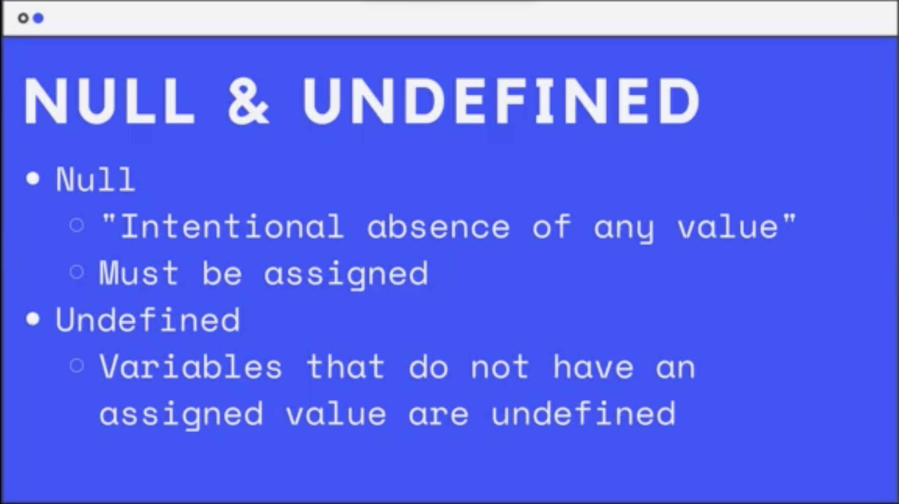

### 5.1. Math Object

```js
// NUMBERS AND THE MATH OBJECT

const num1 = 100;
const num2 = 50;
let val;

// Simple math with numbers
val = num1 + num2;
val = num1 * num2;
val = num1 - num2;
val = num1 / num2;
val = num1 % num2;

// Math Object Methods
val = Math.PI;
val = Math.E;
val = Math.round(2.4);
val = Math.ceil(2.4);
val = Math.floor(2.8);
val = Math.sqrt(64);
val = Math.abs(-3);
val = Math.pow(8, 2);
val = Math.min(2, 33, 4, 1, 55, 6, 3, -2);
val = Math.max(2, 33, 4, 1, 55, 6, 3, -2);
val = Math.random();

val = Math.floor(Math.random() * 20 + 1);
```

### 5.2. TypeOf Operator

1. `typeOf` is an operator, to reutrn the variable type.
2. Use:
   ```js
   str = "Hello"
   typeOf str // O/P: String
   ```

### 5.3. parseInt & parseFloat

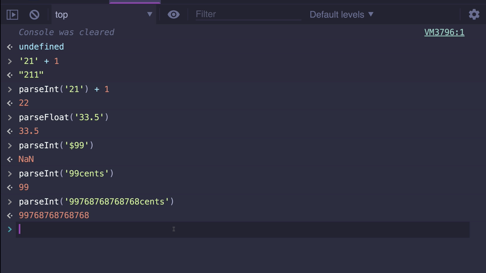

### 5.4. Type Conversion

```js
// TYPE CONVERSION

let val;

// Number to string
val = String(555);
val = String(4 + 4);
// Bool to string
val = String(true);
// Date to string
val = String(new Date());
// Array to string
val = String([1, 2, 3, 4]);

// toString()
val = (5).toString();
val = true.toString();

// String to number
val = Number("5");
val = Number(true);
val = Number(false);
val = Number(null);
val = Number("hello");
val = Number([1, 2, 3]);

val = parseInt("100.30");
val = parseFloat("100.30");
```

### 5.5. Equality

#### 5.5.1. Double Equals

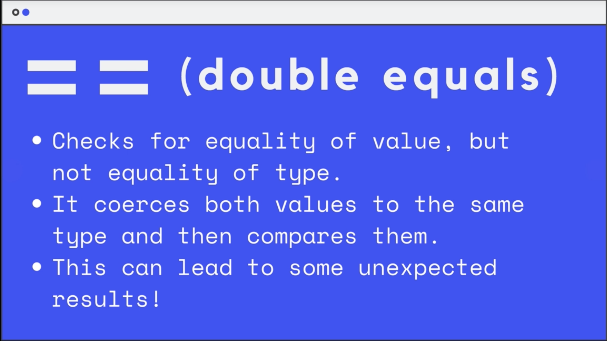
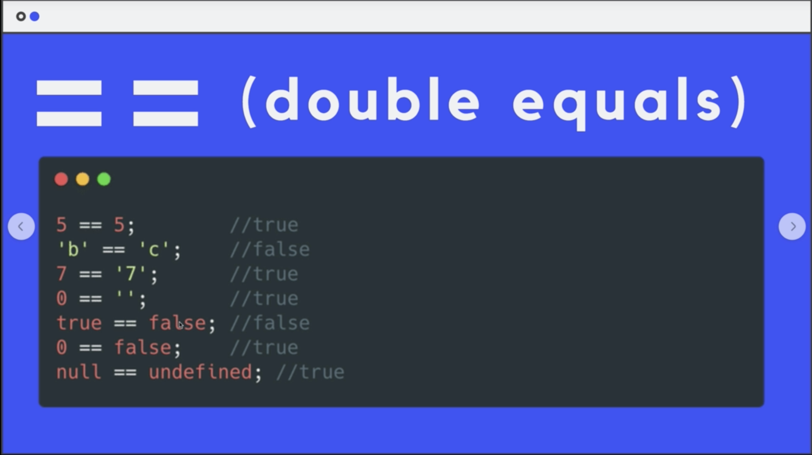

#### 5.5.2. Triple Equals

> Also called Strict Equality Operator
> 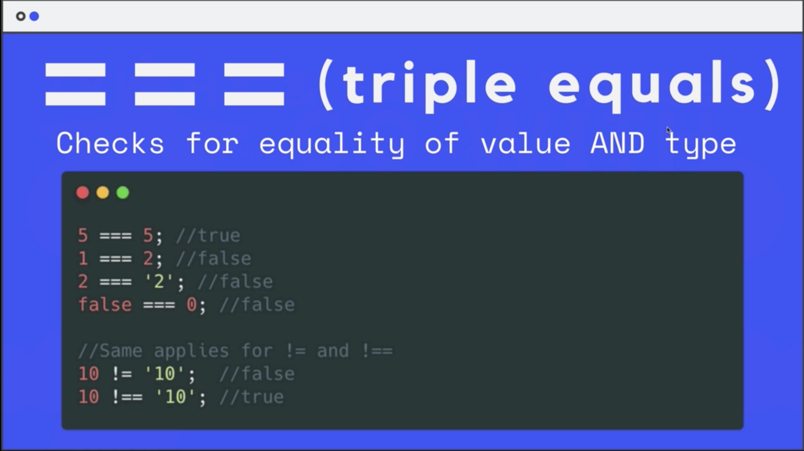

#### 5.5.3. Comparison

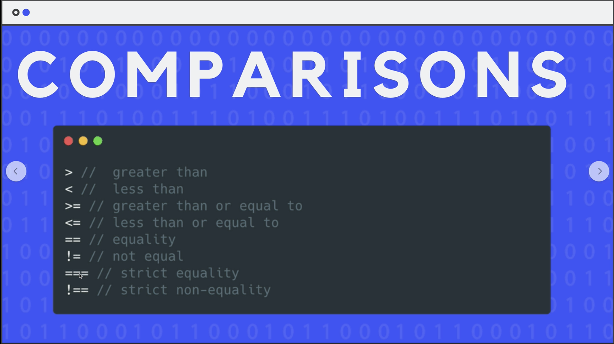

#### 5.5.4. Running Code in a Script

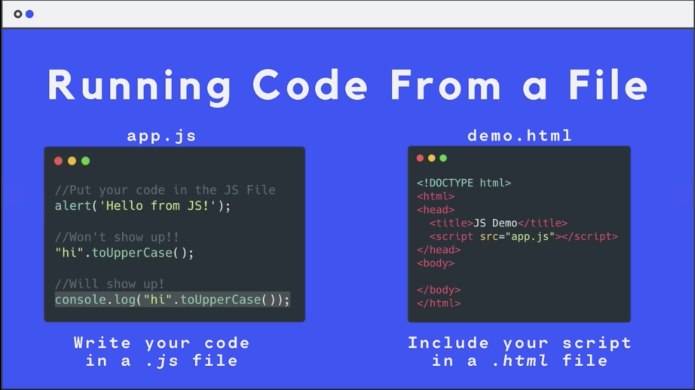

### 5.6. Truthy & Falsy ness

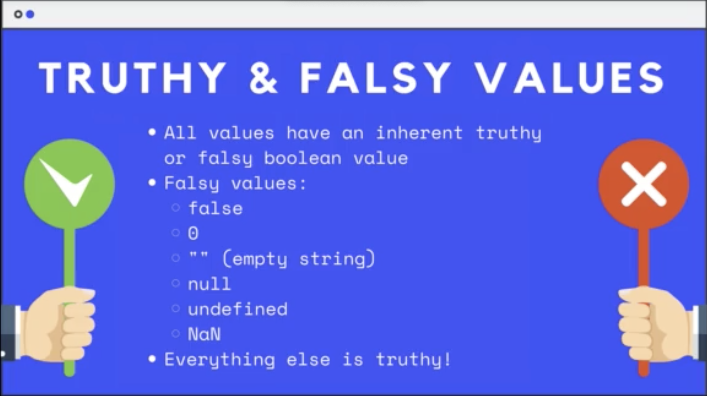

### 5.7. Operator Precedence

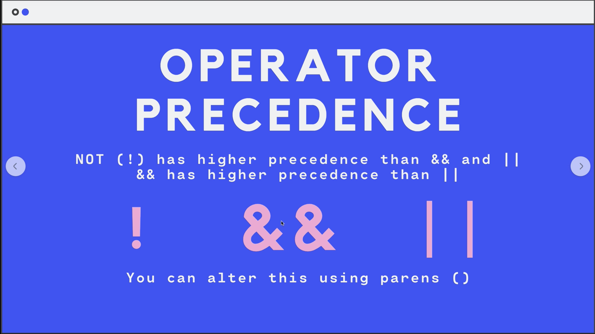

### 5.8. Switch

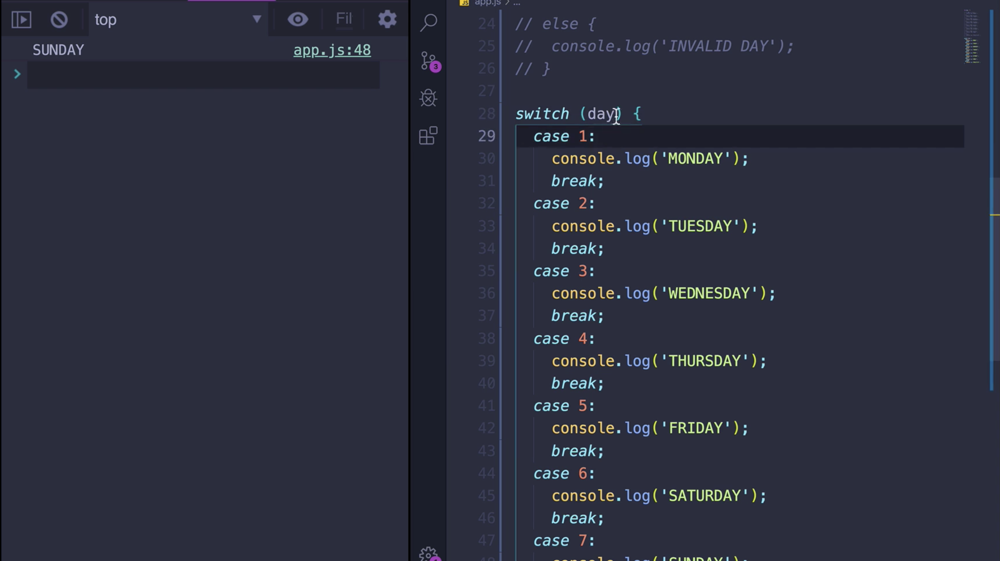

### 5.9. When to Use and When Not-To Use Break

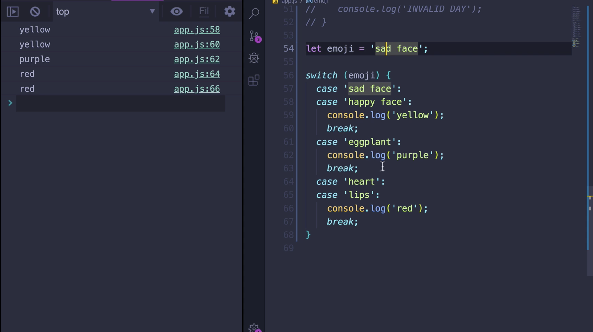
